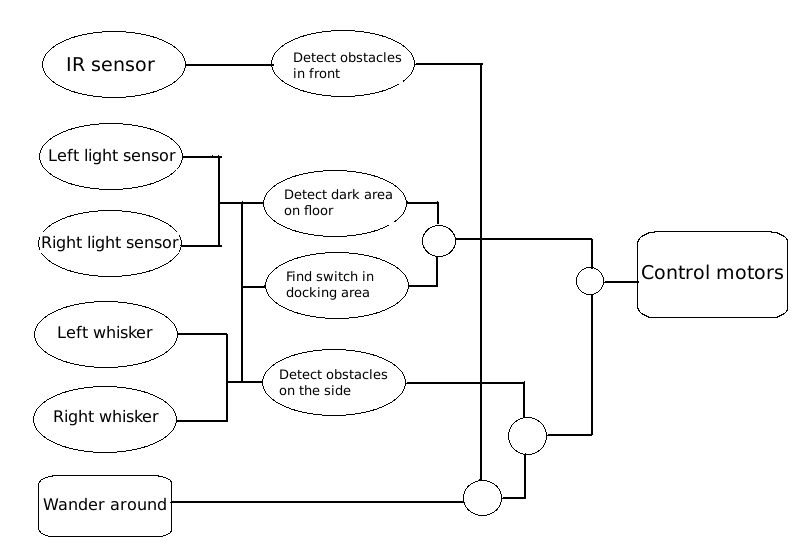

# Report 2 #

Our second task was to find the docking stations and guide the robot to bumping into the switch, that triggered a sequence of lights to appear.

## Hardware modifications ##

For this task we added two light sensors and a light bulb on the bottom of the robot. We placed the light sensors 2.1 centimeters above the floor and placed them 6.8cm apart. The light bulb is placed in between the light sensors such that light from the light bulb reflects from the floor and is detected by the light sensor. The purpose of this arrangement is to detect the difference between normal lab floor and the darker floor of the docking station (see figure 1).

Furthermore we changed the front wheel from a single wheel to a double wheel construction to lessen pressure on this wheel and have smoother steering.

## Software design ##

We have kept our reactive architecture more or less intact from the previous week while simply adding more levels on top. Since we wanted to encourage our robot to explore more, we changed our lowest level behavior from driving in a straight line to following a spiral-like shape. This was implemented using a simple timer as one of the algorithm's inputs.

When the algorithm detects dark flooring underneath, it modifies it's reactions to whisker input and ignores the IR sensor input. The whisker input does not trigger avoidance anymore but simply slight corrections in course. Here we exploit the shape of the docking stations as these have converging walls thus leading the robot to the center where the switch is.

We must note at this point that this behavior is still purely reactive and rather primitive -- if the robot per chance hits the wall at an angle contrary to the flow towards the docking station (this is possible in only certain docking stations; most have their internal angle sharp enough to not let this happen), this algorithm will make him leave the docking station without actually triggering the switch. A solution will probably require to add sensing capabilities for the light emitted by the switch and some internal state on whether the switch was triggered or not.

In our present algorithm we assume that we have hit the switch when both whiskers are triggered and we are above dark flooring. This may seem as a bold assumption since when moving perpendicular to the wall this will be triggered (see above for solution). We also slow down to half speed when on dark floor to avoid this danger.

Here is pseudocode for our control algorithm (see also `Behavior.c`, which implements this):

    if left light sensor detects dark but not right sensor
        drive slowly forward and to the left
    else if right light sensor detects dark but not left sensor
        drive slowly forward and to the right
    else if right and left sensors detect dark
        if only left whisker triggered
            drive slowly forward and to the right
        else if only right whisker triggered
            drive slowly forward and to the left
        else if both whiskers triggered
     	    stop for 2 seconds
      	    drive back for 3 seconds
            rotate left for 3 seconds
        else
            drive slowly forwards
    else if left whisker triggered
        drive backwards to the right for a second
    else if right whisker triggered
        drive backwards to the left for a second
    else if IR sensor detected something ahead
        drive straight back for a second
        drive backwards to the right for a second
	else if timer ticks
        turn and drive left
	else
		drive straigt

