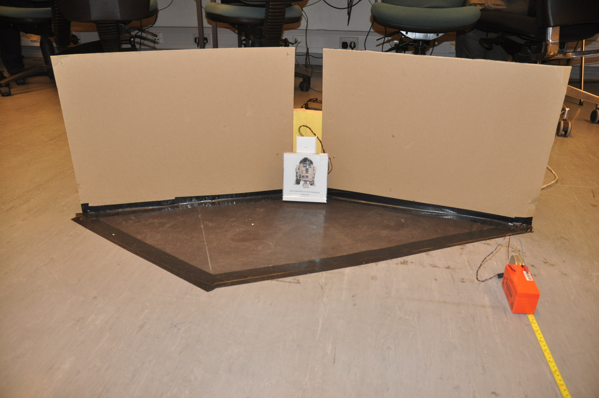

# Final Report

### D. Findrik (0808798), J. Hampl (0802690), L. Kamburov (0838290)

We designed, built and programmed a robot capable of autonomous exploration and recognition of resource sites in its environment. Resource sites consisted of dark flooring which we used two light sensors to detect, walls and a switch that we used two whiskers and two IR sensors to detect and light of a specific frequency emitted after triggering the switch that we detected with two light sensors. A Hall sensor was used to avoid getting stuck. We used a purely reactive architecture for the robot. We carried out an experiment to test the efficiency of our robot in completing its task and we found that out of eight runs it found an average of 2.6 sites and performed 1.5 dances correctly. The main restraint of our robot is the lack of high level planning that could help optimising its site searching strategy.

# Introduction

### Task Description

The goal of this project was to build a robot that was supposed to move around in a lab environment searching for "resource sites". Resource sites were represented as black cardboard parallelograms taped to the floor. Two sides of the resource site had walls 50 centimetres high with a slight gap where they would meet. Here a switch was attached to a light diode that emitted a light pulsing at a specified frequency.

The robot had five minutes to find as many as possible of these resource sites. When a resource site was found the robot was expected to trigger the switch and measure the frequency that was emitted by the light switch. Then one of the following victory dances should have been made based on the frequency of the light switch:

Frequency | Movement
----------|---------
0.5Hz     | Backwards, 360&deg; turn left
1Hz       | Backwards, 360&deg; turn right
2Hz       | Backwards, stop, backwards
4Hz       | Backwards, 180&deg; turn left
6Hz       | Backwards, 180&deg; turn right
8Hz       | Backwards, stop, forwards

---

# Method

## Hardware specification
Main Components of the robot :
          Hardware specification: 
          The main components of the robots are: 
				- Fit pc 
				- PowerBoard 
				- Interface Board(PhidgetInterfaceKit 8 digital outputs, 8 digital inputs and 8 analog input).
				- Sensors.
				- Standart lego kit
				- 2 x DC Motors and a Servo Motor
				- Cables - usb, digital and analog cabels.
	
The robot have three main deattachable parts . The first part 
is the main frame. This is where batery, Dc motors and wheels are. 
We diceded to use chains for our robot in order to ???. The length of the chains is 16 cm.
The second component is the where the middle frame is. 
It consists of interface board and power board. Those boards are mounted to lego parts and added to the robot as part
of the whole frame.
The last part is the front wheel and the  the servo motor attached to it. 
We are using the servo motors to the front so the robot could perform smoother turns.
Wheel spin measurement of the back wheel 12 cm.
Wheel spin measurement of the front wheel 5 cm.
##Design##
Evolution of the robot:

## Measurements:

Greatest width | 23.5cm
---|---
Total length | 39cm
Length of whiskers | 14.5cm
Whiskers sticking out | 2cm
Height of front-facing IR | 5.9cm
end of whiskers are | 6.5cm away from front-facing IR
Height of Top light sensors |15.4cm
Top Light sensors are  | 5.1cm away from each other
Height of Top IR | 22cm (also the height of the robot)
whiskers are | 2.5cm away  
Wheelbase | 8.9cm
Rear wheels' axises are | 8cm away from the back
Distance between bottom light sensors | 8.4cm

TODO write about design

## Sensors

### Front-Facing IR

The primary task that our robot had to achieve in order to succeed in subsequent objectives was obstacle avoidance. The easiest and primary solution to this problem was given by the front-facing infrared sensor on our robot. This sensor measures the closeness of the objects in front of it and returns an integer. It should give the greatest value when the object is touching the sensor, however, due to the implementation of the sensor, the highest value is obtained when the obstacle in front of the robot is approximately 8 cms away. To have a greater understanding about the values returned by the sensor, we have carried out a test and measured the values obtained from the sensor between 0 and 17 centimeters with 0.5 cm increments and the result is shown in Figure x. The robot is programmed to obtain readings from the sensors continuously and retreats when the value from the sensor rises above a certain threshold, which represents a slightly greater distance than the length of the whiskers. In this case, the robot drives back and turns to avoid the obstacle.

### Whiskers

We have attached two whiskers to the robot that are pointing forwards and outwards from the robot - one on the left and one on the right. These sensors are triggered when the whisker touches the ring that surrounds it at its base and returns the value 1, otherwise 0 (see figure x). The purpose of the using the whisker sensors is to avoid obstacles that are invisible to the front-facing IR sensor and making sure that the robot does not attempt to enter a gap that is thinner than itself and this use of them was inspired by cats' whiskers which serve the same purpose. The whiskers are x cms long and sticking out x cms to the side. The robot's reactive behavior to the whiskers being triggered is shown in figure x (insert the picture of that behavior here). The problem with the whiskers is, however, that the input we obtain is noisy due to the oscillation of the whiskers. In our implementation we overlook this fact as the oscillation usually settles down by the time the reactive behavior is executed.
Both the front-facing IR sensor and the whiskers have been part of our robot since the first version.

### Bottom light sensors
For the task in Week 4, our robot had to distinguish dark floor from light floor, hence we needed sensors that give information about the floor to our system. Therefore we installed two light sensors to the bottom of the robot which measure the brightness of the object . To minimise the effect of the changes in light conditions, we have attached a lightbulb to the bottom of the robot between the two sensors. This provides a consistent source of light and minimises the variance between brightness values obtained from dark and light floor. We use thresholding based on the average of the first values obtained from the left and right sensors after starting our program, assuming our robot starts on light floor. We also use the position of the sensors to navigate into resource sites. (image of the bottom of the robot) // also add measurements: how far are the light sensors from each other and from the light

### Top light sensors
For Week 5 our robot had to recognise the frequencies with which the lights above the switches were flashing. In order to be able to do that, we have installed two light sensors to the front of the robot at the same height as the flashing LEDs are. These sensors are at the two sides of the robot and we take an average (?? have to check this) of the values to use for frequency detection (more about this in Functions/Frequency detection). The reasoning behind the placement of these sensors is that our robot might not be perfectly in front of the light when it triggers the switch, however, this way we can ensure that either of the sensors will reach the threshold required to determine the frequency. (picture of the front of the robot)

### Hall sensor
The Hall sensor can detect whether the wheels are moving by changing the output whenever the bar inside it makes a full turn. We use this sensor to identify the case when our robot is stuck even though none of the other sensors indicate that as they are not triggered. It can also be used to detect obstacles behind the robot by believing that the robot got stuck whilst driving backwards. The Hall sensor is attached to the top of the rear left wheel and is connected via a track to the axis of the wheel (see image). The reasoning behind placing it there is that whenever the robot is stuck the wheels stop moving (even powered wheels) and it was easier to install them then to place them on the front wheel.

### Top IR
We have attached an IR sensor, facing approximately 45˚ upwards, to the front of the robot to detect the gap at the resource site between the walls and help in guidance to the switch (see image of gap and IR sensor). This idea was implemented after seeing it working successfully on the robot of group A5. (all the others told us that we better mention them...)

## Robotic control

One of our first design decisions (inspired by  Brooks, 1990) was to try to create a purely reactive control architecture to solve the task assigned to us. This was partially successful in the sense that we managed to have the robot navigate around in this manner, without the need to use planning or active sensing. 

Our control algorithm is layered where bottom layers effect how the bottom layers react to sensory input. However each of these layers are directly dependent on sensory input (there is a bit of state retained in the robot, however there is so little that calling it a model would be exaggerated). 

A top level priority is finding out whether the robot is stuck somewhere. If not (or this hasn't been detected yet, see bellow for details), then we use light sensors on the bottom of the robot to detect dark flooring. When on the dark floor all movements tend to be smaller and less pronounced. Also the reaction to the whisker sensors becomes smaller to have a more wall hugging behaviour.

The lowest level are reactions to the whisker sensors and the front IR sensors. The remaining sensors are checked for values only when the other sensors mandate a possibility of them being useful.

### Strategies

Since creating reactive robots is all about using simple reactions to orchestrate more complex behaviours. 

### Wall hugging

Inspired by Schank et al. (2006) we have used the two whisker sensors to avoid hitting a wall but intend the robot will back up a little in the direction that the whisker was triggered and then continue driving forwards presumably to hit the wall a couple of centimetres onwards. With this property we have tried to exploit two important properties of the environment. Our robots will have a high probability of ending up in corners (as discussed in Schank et al.; although they generate this behaviour by virtue of the robot's shape only, we considered that approach impractical with LEGO robots) and corners are where all of the light switches are. The second important property was that 6 out of the 10 walls of the resource sites aim at walls of other resource sites. So when the robot follows such a wall when the wall ends it will continue straight and hit the wall in the next resource site and then it will follow that wall all the way to the switch. The 8Hz resource site had the nice property that both of its walls led to another resource site, and this was in fact often exploited by the robot.

### Stuck Detection

In order to ensure that our robot does not get stuck for an extended period of time, we have installed the Hall sensor to recognise when the wheels are stationary. The input from the sensor changes parity when the magnet on the bar passes the sensor, i.e. makes a full turn. We exploit this behavior along with the fact that our main function, which defines every movement, is called every 50ms to determine the state "being stuck". The simplest approach was to count the number of loops when the input from the sensor has not changed. A single cycle of "being stuck" is defined by seven iterations of the main code called without change in the input. The robot considers itself being stuck after the third such cycle. If at any time the input changes, both the number of cycles and iterations are reset to zero. After the robot has realised that it is stuck, it makes the opposite movement that it was making previously, i.e. either go forward or back. This is done by storing the intended orientation when the robot starts to move in a given direction.

### Frequency measurement

Frequency of the light switch mainly exploits the hardware configuration of the robot which guarantees that if the light is triggered at least one of its two light sensors will be in front of it. Once one of these sensors reach a certain threshold of activation, we stored the time this happened. When both of the sensors went bellow the threshold and again above it we subtract the two times to get the period and then derived $f = \frac{1}{T}$.

We carried out tests to verify the efficiency of this method. In these experiments the robot was aligned facing the switch, the program was started and we let the robot find the switch, trigger it and readings of frequencies were recorded. For all lights that were available in the laboratory, we have measured the frequencies ten times and the result is shown by Figure x. The algorithm performs constantly well for lower frequencies with a mean of 0.984Hz (SD=0.002) for the 1Hz switch and 1.956Hz (SD=0.009) for the 2Hz switch. The higher frequencies showed more variance but still were very accurate with a mean of 3.984Hz (SD=0.121) for the 4Hz light,  with 5.925Hz (SD=0.086) for the 6Hz light and 7.863Hz (SD=0.114) for the 8Hz light.

## Experimental Design

Our main concern was the performance of the robot on its main task. We tested this in eight repeated 5 minute trials. We measured how many resource sites would the robot  reach, how many light switches would it manage to trigger and how many victory dances it performed correctly. The robot was always placed in the centre of the arena with a constant starting orientation facing one of the switches. The experimenters did not interfere with the operation of the robot.

We counted as reaching a resource site if the full body of the robot was over the dark area (NB we did not judge whether the robot in fact recognised it was over the dark area since its behaviour was very similar to that when it was outside and it was impossible to be sure whilst still keeping the robot autonomous). We counted as triggering the light switch if at least two consecutive flashes were seen and counted as a successful dance if the robot did the prescribed motions within a roughly &plusmn;35&deg; range as judged visually by the experimenters.

---

# Results

The robot managed on average to find 52.5% (=2.63 sites, SD=0.92) of the resource sites in the allocated 5 minutes. It's average success rate of triggering the switch after finding the site was 70.8% (SD=0.32). If the light switch was triggered the robot performed the dance correctly 91.7% of the time (SD=0.15).

Run | Resource sites reached | Lights triggered | Dances performed
----|---------------------|------------------|------------------
#1  | 3                   |                3 |                2
#2  | 2                   |                1 |                1
#3  | 1                   |                1 |                1
#4  | 4                   |                2 |                2
#5  | 2                   |                2 |                2
#6  | 3                   |                3 |                2
#7  | 1                   |                1 |                1
#8  | 3                   |                1 |                1
Mean |        2.625       |            1.625 |               1.5 
Standard Deviation |  0.916 |       0.744    | 0.535

# Discussion

### Strengths and Weaknesses of current design

Based on the results we can see that there is much to be done in terms of finding the resource sites. The five minute time period seems too short to reach all of the resource sites without a very well planned strategy and some idea of the global layout of the arena. Also performance in this matter was very unreliable, with some runs being very successful and others quite tragic. This seems to have depended on minute physical variance in the environment since the code of the robot is entirely deterministic.

The strength of our robot was that it always acted and almost never got permanently stuck. Another interesting property we observed is that even when some of its sensors malfunctioned or disconnected it managed to continue in its task (albeit with lower efficiency).

### Corner oscillation 

An interesting side effect of our various behaviours interacting was when the robot got to a corner in the lab it tended to oscillate between driving out in one direction or the other. This is caused by the fact that the robot is basically designed to reach centres of corners (where we presume the light switches are). The robot didn't get stuck in the oscillatory pattern for ever, due to subtle differences in turning on both sides (caused by one wheel having additional friction caused by the Hall sensor) it would eventually manage to get out.

# References

0. Brooks, R. (1990). Elephants Don't Play Chess. *Robotics and Autonomous Systems*.
1. Schank, J., Joshi, S., Tran, J., Taylor, R., May, C. J., & Scott, I.-E. (2006). Rat pups and random robots generate similar self‐organized and intentional behavior. *Complexity*.

# Source code

The source code can be found at http://github.com/gampleman/Robot-IAR.
